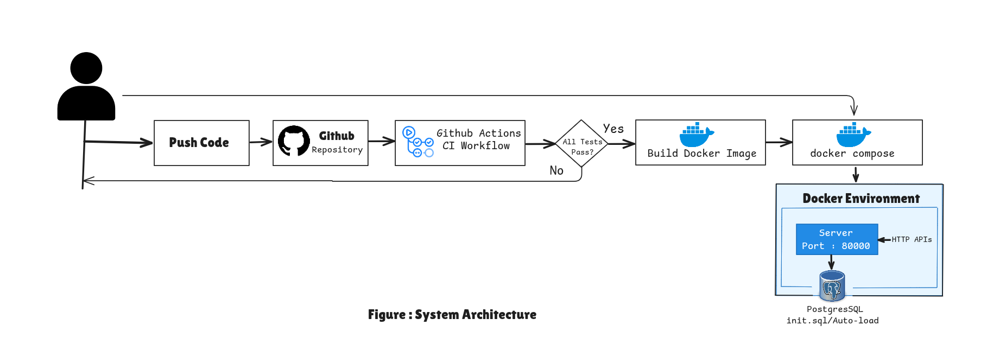
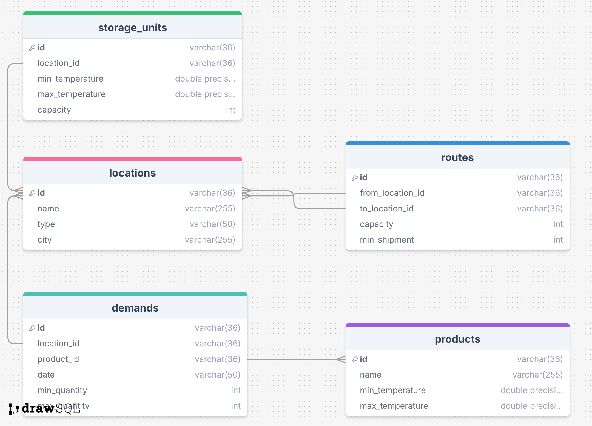
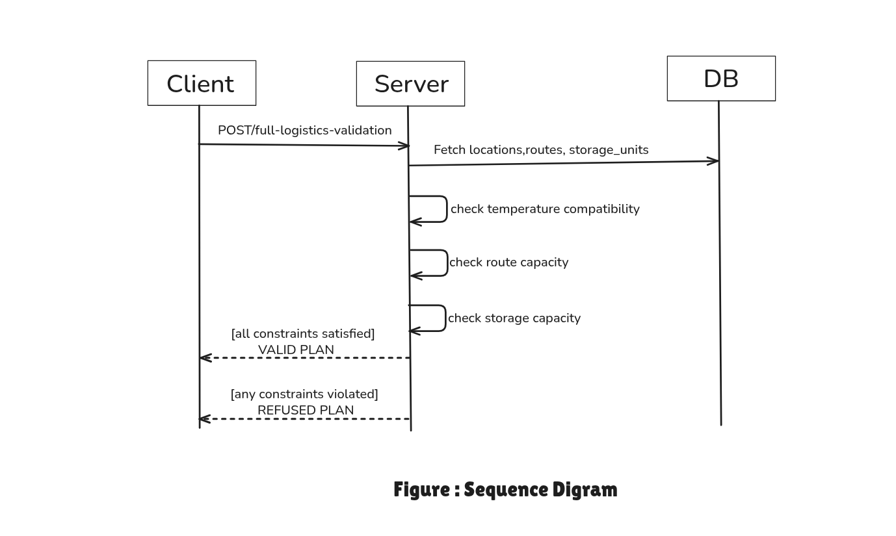

#  Logistics Platform API

>A  Spring Boot and PostgreSQL based backend for managing logistics operations including locations, storage units, products, routes, and demands.

---


## 1. Documentation

| Resource | Description | View Link |
| --- | --- | --- |
| **Swagger UI** | Swagger API Docs  | [Explore Docs](https://logistics-platform-server-glo4.onrender.com/swagger-ui/index.html) |
| **Postman** |Postman API collection | [View Collection](https://www.postman.com/mission-administrator-41711140/workspace/logistics-platform/collection/47147985-1b57e4cd-9dcc-40aa-9e22-74807a242f13?action=share&creator=47147985&active-environment=47147985-abbbf3aa-ed0d-428b-aa70-e3f5949902b7) |
| **Architecture** | System Architecture | [View Design](https://excalidraw.com/#json=NqbzsXSX_5nX0i-A3z9Ke,8_4CJndKNrjwbE7DKE-l8Q) |
| **DB Design** | Entity-Relationship Diagram |[View Schemas](https://drawsql.app/teams/alamgirhere/diagrams/logistics-platform)|
| **Validation** | Sequence Digram for Full Logistics Validation | [View Sequence Diagram](https://excalidraw.com/#json=3Vdwbid7lxSTlaSirOktS,PUO1n8q__iMbWy3X_nZKEQ) |


##  2. Tech Stack


| Component | Technologies |
| --- | --- |
| **Backend** | Java 21 (Temurin), Spring Boot 3.5.10 |
| **Data Access** | Spring Data JPA (Hibernate) |
| **Database** | PostgreSQL 15 |
| **Containerization** | Docker, Docker Compose |
| **CI/CD** | GitHub Actions |
| **Deployment** | Render (Managed Cloud) |


---

## 3. Quick Start (Local Run)

Get the entire system up and running in minutes using Docker:

1. Clone the repository

    ```bash
    git clone https://github.com/alamgir-ahosain/logistics-platform.git
    ```
2. Navigate to the project directory

    ```bash
    cd logistics-platform
    ```
3. Spin up the containers

    ```bash
    docker compose up --build -d
    ```

>**The API will be available at `http://localhost:8000`**

---


## 4. Local Setup (Without Docker)

If  prefer to configure the environment manually or run the application without Docker, follow these steps:

 1. Clone the Repository

    ```bash
    git clone https://github.com/alamgir-ahosain/logistics-platform.git
    cd logistics-platform
    ```
 
 2. Environment Configuration

    Create a `.env` file in the `server/` directory. This project uses `java-dotenv` to load credentials securely.

    ```env
    DB_HOST=
    DB_PORT=
    DB_NAME=
    DB_USER=
    DB_PASSWORD=
    ```
    >Do NOT commit .env Put it in .gitingore

 3. Build the Project

    Ensure JDK 21 is installed. Use the Maven wrapper to install dependencies:

    ```bash
    cd server
    ./mvnw clean install
    ```

 4. Run the Application

    Start the Spring Boot server:

    ```bash
    ./mvnw spring-boot:run
    ```

 5. Access the Application

    The API will be available at: `http://localhost:8000/`


---

## 5.  Project Structure

```md
├── server/                 # Spring Boot Application
│   ├── src/                # Source code
│   ├── Dockerfile          # Production Docker build
│   └── .env                # Environment variable template
├── database/               # SQL scripts
│   └── Init.sql            # Initial schema
└── docker-compose.yml      # Local development setup
```

##  6. System Architecture




##  7. Database Design




## 8.Logistics Validation 




